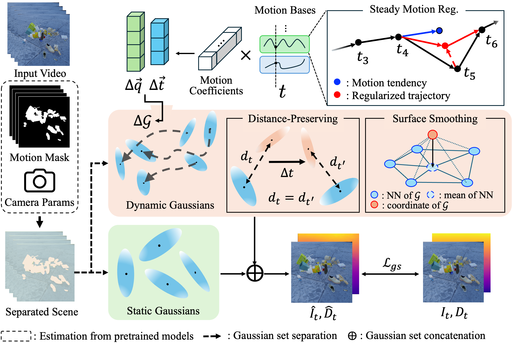

# Robust Dynamic Gaussian Splatting for Casual Videos
### [Project Page](https://rodygs.github.io/) | [Paper](https://www.arxiv.org/abs/2412.03077) | [Video](https://www.youtube.com/watch?v=pwv4Gwl07Tw)
#### [Yoonwoo Jeong](https://jeongyw12382.github.io/), [Junmyeong Lee](https://www.linkedin.com/in/junmyeong-lee/), [Hoseung Choi](https://www.linkedin.com/in/hoseung-choi/), [Minsu Cho](https://cvlab.postech.ac.kr/~mcho/)




## News
- [2024-12-11] We have released the code. (dataset coming soon)

## Abstract
Dynamic view synthesis (DVS) has advanced remarkably in recent years, achieving high-fidelity rendering while reducing computational costs. Despite the progress, optimizing dynamic neural fields from casual videos remains challenging, as these videos do not provide direct 3D information, such as camera trajectories or the underlying scene geometry. In this work, we present RoDyGS, an optimization pipeline for dynamic Gaussian Splatting from casual videos. It effectively learns motion and underlying geometry of scenes by separating dynamic and static primitives, and ensures that the learned motion and geometry are physically plausible by incorporating motion and geometric regularization terms. We also introduce a comprehensive benchmark, Kubric-MRig, that provides extensive camera and object motion along with simultaneous multi-view captures, features that are absent in previous benchmarks. Experimental results demonstrate that the proposed method significantly outperforms previous pose-free dynamic neural fields and achieves competitive rendering quality compared to existing pose-free static neural fields.

## Short Description Video

[](https://www.youtube.com/watch?v=pwv4Gwl07Tw)


## Installation
The codes have been tested on Python 3.11 with CUDA version 12.2.
```bash
git clone https://github.com/POSTECH-CVLab/RoDyGS.git --recursive
cd RoDyGS

conda create -n rodygs python=3.11 -c anaconda -y
conda activate rodygs

conda install pytorch==2.0.1 torchvision==0.15.2 torchaudio==2.0.2 pytorch-cuda=11.7 -c pytorch -c nvidia -y
pip3 install plyfile==1.0.3 omegaconf==2.3.0 tqdm==4.66.4 piqa==1.3.2 scipy==1.13.1 tifffile==2024.7.24 pandas==2.2.2 numpy==1.24.1 gradio==3.39.0 av=10.0.0 imageio==2.19.5 imageio-ffmpeg
pip3 install opencv-python matplotlib trimesh roma einops huggingface_hub ninja gdown progressbar mmcv
pip3 install git+https://github.com/facebookresearch/segment-anything.git

pip3 install thirdparty/simple-knn
pip3 install thirdparty/diff-gaussian-rasterization
pip3 install thirdparty/pytorch3d
```

## Dataset Format
- First, you need to set up the dataset in the following format to run RoDyGS.
```
[scene_name]
	|- train                     # train images
		|- rgba_00000.png
		|- rgba_00001.png
		|- ...
	|- test                      # test images
		|- rgba_00000.png
		|- rgba_00001.png
		|- ...
	|- train_transforms.json     # train camera information
	|- test_transforms.json      # test camera information
```

<details>
<summary>The format of train_transforms.json</summary>

- The units for "camera_angle_x" and "camera_angle_y" are in degrees.
- The range of "time" is from 0.0 to 1.0.
- The format of "transform_matrix" follows the OpenCV camera-to-world matrix.
- "train/rgba_\*.png" in "file path" should be changed to "test/rgba_\*.png" in test_transforms.json.
```json
{
    "camera_angle_x": 50,   
    "camera_angle_y": 50,
    "frames": [
        {
            "time": 0.0,
            "file_path": "train/rgba_00000.png",
            "width": 1920,
            "height": 1080,
            "transform_matrix": [
                [
                    1.0,
                    0.0,
                    0.0,
                    0.0
                ],
                [
                    0.0,
                    1.0,
                    0.0,
                    0.0
                ],
                [
                    0.0,
                    0.0,
                    1.0,
                    0.0
                ],
                [
                    0.0,
                    0.0,
                    0.0,
                    1.0
                ]
            ]
        },
        {
            "time": 0.01,
            "file_path": "train/rgba_00001.png",
            "width": 1920,
            "height": 1080,
            "transform_matrix": ~
		},
		...
		        {
            "time": 0.99,
            "file_path": "train/rgba_00099.png",
            "width": 1920,
            "height": 1080,
            "transform_matrix": ~
		}
	]
}
```
</details>

## Running
### Pre-processing

- Please download the checkpoints from https://github.com/naver/mast3r ("MASt3R_ViTLarge_BaseDecoder_512_catmlpdpt_metric") and https://github.com/DepthAnything/Depth-Anything-V2 ("Depth-Anything-V2-Large").

- You need to run Track-Anything and obtain motion masks from the demo UI. For more information, visit https://github.com/gaomingqi/Track-Anything.
```bash
cd RoDyGS/thirdparty/Track-Anything
python3 app.py --mask_save True
```

- Then, follow these steps:
```bash
cd RoDyGS

# Get TAM mask
python3 -m scripts.img2video --data_dir [path_to_dataset_dir]
python3 -m scripts.tam_npy2png --npy_dir [path_to_tam_npy_mask] --output_dir [path_to_dataset_dir]

# Run Depth Anything
python3 -m scripts.run_depthanything --encoder [encoder_type] --encoder-path [path_to_encoder_ckpt] --img-path [path_to_image_dir] --outdir [path_to_output] --raw-depth

# Run MASt3R
python3 -m scripts.run_mast3r.run --input_dir [path_to_images] --exp_name [mast3r_expname] --output_dir [path_to_mast3r_output] --ckpt [path_to_model_ckpt] --cache_dir [path_to_cache_output]
python3 -m scripts.run_mast3r.depth_preprocessor.get_pcd --datadir [path_to_dataset_dir] --mask_name [mask_dir_name] --mast3r_expname [mast3r_expname]
```
<details>
<summary>example commands</summary>

```bash
python3 -m scripts.img2video --data_dir data/kubric_mrig/scene0
python3 -m scripts.tam_npy2png --npy_dir thirdparty/Track-Anything/result/mask/train --output_dir data/kubric_mrig/scene0

python3 -m scripts.run_depthanything --encoder vitl --encoder-path checkpoints/depth_anything_v2_vitl.pth --img-path data/kubric_mrig/scene0/train --outdir data/kubric_mrig/scene0/depth_anything --raw-depth

python3 -m scripts.run_mast3r.run --input_dir data/kubric_mrig/scene0/train --exp_name mast3r --output_dir data/kubric_mrig/scene0/mast3r_opt --ckpt MASt3R_ViTLarge_BaseDecoder_512_catmlpdpt_metric.pth --cache_dir mast3r_cache/

python3 -m scripts.run_mast3r.depth_preprocessor.get_pcd --datadir data/kubric_mrig/scene0/ --mask_name tam_mask --mast3r_expname mast3r_000
```
</details>


- After pre-processing, your dataset will have the following format:
```
[scene_name]
	|- train                     # train images
	|- test                      # test images
	|- train_transforms.json     # train camera informations
	|- test_transforms.json      # test camera information
	|- tam_mask
	|- depth_anything
	|- mast3r_opt
		|- [expname]
			|- dynamic            # dynamic point clouds (per frame)
			|- static             # static point clouds (per frame)
			|- op_results         # merged point clouds (unseperated)
			|- global_params.pkl  # initial camera poses
```

### Training
```bash
python3 -m src.pipelines.train -d [path_to_dataset_dir] -b [path_to_training_config] -g [loggin_group_name] -n [training_log_name]
```
<details>
<summary>example commands</summary>

```bash
python3 -m src.pipelines.train -d data/kubric_mrig/scene0/ -b configs/train/train_kubric_mrig.yaml -g kubric_mrig -n scene0
```
</details>

### Rendering & Evaluation
- We used "configs/eval/eval_w_align.yaml" for iPhone dataset evaluation.
- And we used "configs/eval/eval_w_align.yaml" for Kubric-MRig & NVIDIA Dynamic dataset evaluation.
```bash
python3 -m src.pipelines.eval -c [path_to_config] -t [test_log_name] -d [path_to_dataset] -m [path_to_training_log]
```
<details>
<summary>example commands</summary>

```bash
python3 -m src.pipelines.eval -c configs/eval/eval_wo_align.yaml -t eval -d ../data/kubric_mrig/scene0/ -m logs/kubric_0_0777/
```
</details>

